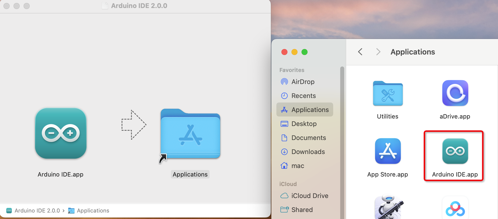

3.Install Arduino IDE
=======================

This section will guide you through the installation of the Arduino IDE development environment.

**Step 1: Download Arduino IDE 2.x.x**
-----------------------------------------

#. Visit the `Download Arduino IDE <https://www.arduino.cc/en/software>`_ page.

#. Download the IDE version compatible with your operating system.

   .. image:: img/Install_Arduino_IDE_1.png

**Step 2: Install Arduino IDE**
--------------------------------
Windows
^^^^^^^^

#. Double-click the ``arduino-ide_xxxx.exe`` file to start the installation.

#. Read and accept the License Agreement.

   .. image:: img/Install_Arduino_IDE_2.png

#. Select your installation options.

   .. image:: img/Install_Arduino_IDE_3.png

#. Choose the installation location. We recommend installing the software on a drive other than the system drive.

   .. image:: img/Install_Arduino_IDE_4.png

#. Complete the installation.

   .. image:: img/Install_Arduino_IDE_5.png

MacOS
^^^^^^^^

Double-click the downloaded ``arduino_ide_xxxx.dmg`` file and follow the instructions to copy **Arduino IDE.app** to the **Applications** folder. The Arduino IDE will be successfully installed after a few seconds.

Linux
"""""""

For instructions on installing Arduino IDE 2.0 on Linux, please refer to the official `Linux Installation Guide <https://docs.arduino.cc/software/ide-v2/tutorials/getting-started/ide-v2-downloading-and-installing#linux>`_.

**Step 3: Configure Arduino IDE**
------------------------------------
#. When you first launch Arduino IDE 2.0, it will automatically install Arduino AVR Boards, built-in libraries, and other required files.

   .. image:: img/Install_Arduino_IDE_7.png

#. Your firewall or security center may display several prompts asking for permission to install device drivers. Please allow all these installations.

   .. image:: img/Install_Arduino_IDE_8.png

#. Your Arduino IDE is now ready to use!

.. note::
   If some installations fail due to network issues or other reasons, you can restart the Arduino IDE to complete the remaining installations. The Output window will only appear when you click Verify or Upload, not automatically after installation.

