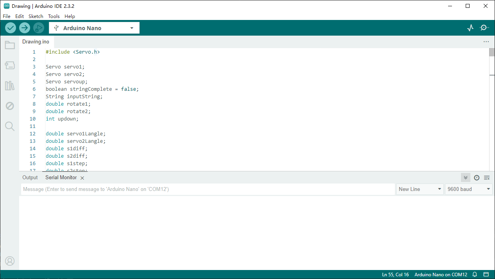
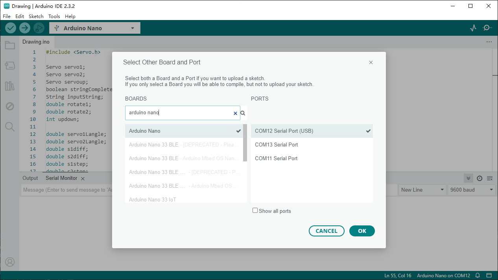
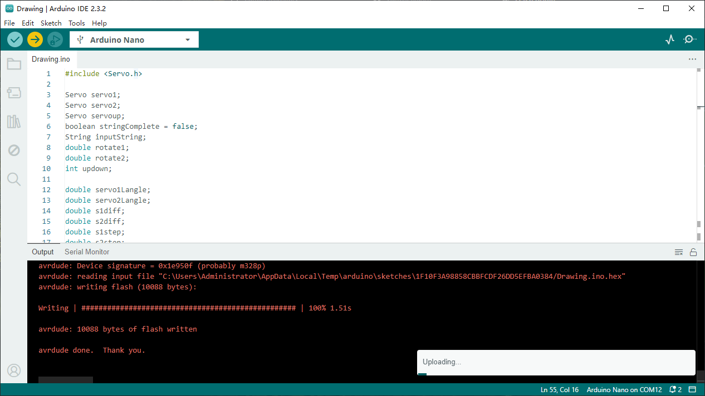

Upload the Main Program
========================

This section will guide you on how to upload the code to your device.

First, open the main program file (Drawing.ino) that you downloaded

Then connect the device to your computer using the included mini USB cable, open Arduino IDE, and select the correct port and board (Arduino Nano).

.. attention:: 
    You need to remove the HC-04 Bluetooth module before uploading the code, otherwise you will get an error.

Then click the upload button and wait for the upload to complete.

At this point, we have completed the installation of the main program.