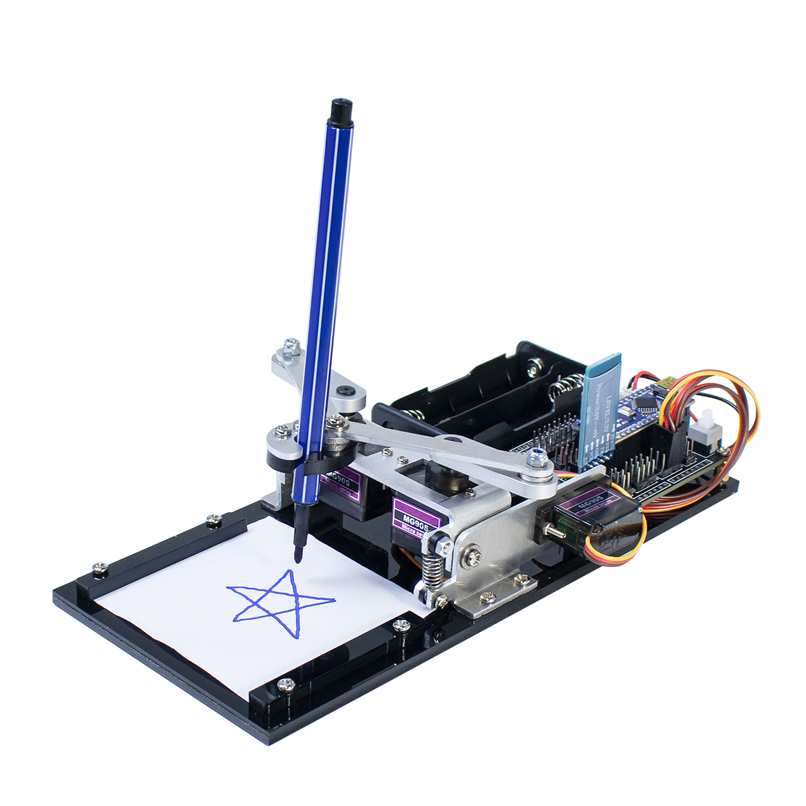

About This Kit
===============

   Overview of the DrawingBot Components

LAFVIN DrawingBot
-----------------

Introduction
^^^^^^^^^^^^
This intelligent drawing robot kit combines robotics and digital art creation. Utilizing Arduino Nano as the core controller, the system integrates multi-axis motion control through three precision servos, enabling accurate drawing operations via wireless controls.

Key Features
^^^^^^^^^^^^
* **Control System**
    - Arduino Nano controller with stable performance
    - Compatible with Arduino IDE development environment
* **Wireless Connectivity**
    - Built-in HC-06 Bluetooth module (4.0 BLE)
    - Cross-platform support: iOS & Android
* **Motion System**
    - 3x SG-90 micro servos (180° rotation)
    - ±2° positioning accuracy
* **Core Functions**
    - Real-time remote control mode
    - Path recording & playback functionality
    - Emergency stop function
* **Learning Resources**
    - Step-by-step assembly video tutorials
    - :download:`Get Started Guide </manuals/quickstart.pdf>`
    - Sample code repository

Application Scenarios
^^^^^^^^^^^^^^^^^^^^^
Education & Research
    Teach fundamentals of:
    - Robotics kinematics
    - Embedded programming
    - Mechatronic system integration

Creative Design
    Apply for:
    - Digital artwork creation
    - Geometric pattern drawing
    - Personalized postcard design

Bill of Materials
^^^^^^^^^^^^^^^^^
.. list-table:: 
   :header-rows: 1
   :widths: 35 15 50

   * - Component
     - Qty
     - Specifications
   * - Arduino Nano
     - 1
     - ATmega328P, 16MHz
   * - Servo Motor
     - 3
     - SG-90 Micro Servo (4.8-6V DC)
   * - Bluetooth Module
     - 1
     - HC-06 (Class 2, +4dBm)
   * - Power Supply
     - 1
     - 2x18650 Battery Holder (*Batteries not included)
   * - Mechanical Kit
     - 1
     - 6063 Aluminum Alloy Parts

.. note::
   Full assembly requires standard M3 screws (included). Recommended workspace: flat surface > 40x40cm.
